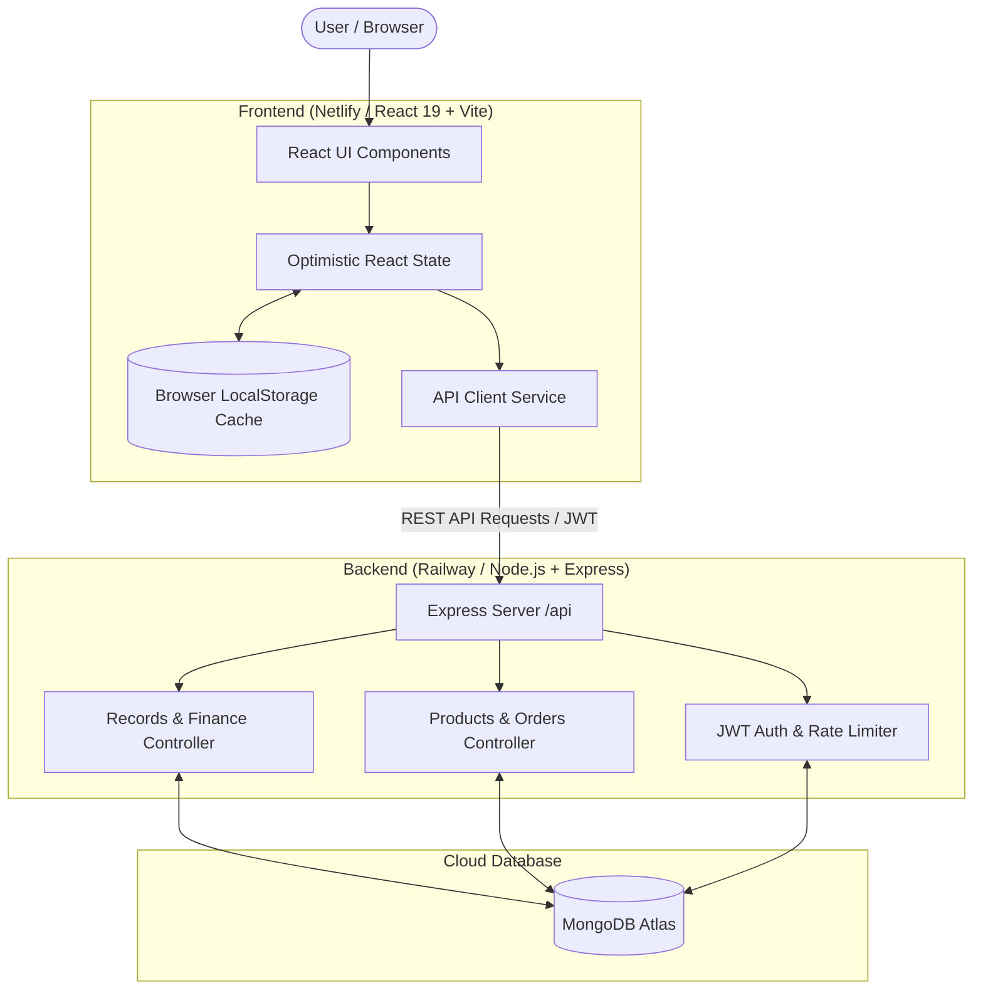

# 🛍️ Shoplytics — E-Commerce Financial & Analytics Dashboard

[](https://reactjs.org/)
[](https://vitejs.dev/)
[](https://nodejs.org/)
[](https://expressjs.com/)
[](https://www.mongodb.com/)
[](https://recharts.org/)
[](https://railway.app/)
[](https://www.netlify.com/)

**Shoplytics** is a production-ready, full-stack SaaS e-commerce analytics and financial management dashboard. It equips online store owners and managers with real-time financial tracking, Profit & Loss (P&L) calculation, Cost of Goods Sold (COGS) analytics, dynamic multi-item expense reporting across custom date ranges, order fulfillment tracking, inventory monitoring with low-stock alerts, and secure JWT authentication.

---

## 📑 Table of Contents

- [✨ Key Features](#-key-features)
- [🏗️ System Architecture](#️-system-architecture)
- [💻 Tech Stack](#-tech-stack)
- [📂 Project Structure](#-project-structure)
- [🚀 Getting Started](#-getting-started)
  - [Prerequisites](#prerequisites)
  - [1. Clone Repository](#1-clone-repository)
  - [2. Backend Configuration & Setup](#2-backend-configuration--setup)
  - [3. Frontend Configuration & Setup](#3-frontend-configuration--setup)
  - [4. Default Demo Credentials](#4-default-demo-credentials)
- [⚙️ Environment Variables](#️-environment-variables)
- [📡 API Reference](#-api-reference)
- [🚀 Deployment](#-deployment)
  - [Backend Deployment (Railway)](#backend-deployment-railway)
  - [Frontend Deployment (Netlify)](#frontend-deployment-netlify)
- [🛡️ Security & Resilience](#️-security--resilience)
- [📄 License](#-license)

---

## ✨ Key Features

### 📊 Real-Time Financial & P&L Analytics
- **Executive Metric Cards**: Instant calculation of Gross Revenue, Product Cost (COGS), Total Operating Expenses, Gross Profit, Net Profit, and Net Profit Margin (%).
- **Interactive Visualizations**: Powered by Recharts with dynamic revenue vs. expense area/bar charts and monthly trend comparisons.
- **Direct Financial Overrides**: Inline controls to update monthly revenue targets and product costs on the fly.

### 📅 Custom Date Range & Multi-Expense Financial Reports
- **Arbitrary Period Reporting**: Generate and save P&L statements for specific date windows (e.g., promotional campaigns, custom fiscal periods).
- **Dynamic Multi-Item Expense Builder**: Add, edit, categorize, and delete itemized expenses within custom reporting windows.
- **Itemized Breakdown Modal**: Inspect detailed cost structures for any previously saved period.

### 🛒 Order Management & Fulfillment
- **Comprehensive Order Table**: View orders with customer info, product details, amounts, payment methods, and timestamps.
- **Status Lifecycle**: Toggle statuses between `Pending`, `Processing`, `Delivered`, and `Cancelled` with optimistic UI and live database updates.
- **Search & Filtering**: Instant search and filter by order status.

### 📦 Product Catalog & Smart Inventory
- **Product Management**: Track catalog items, pricing, SKUs, and stock availability.
- **Automated Low-Stock Badges**: Real-time alerts when inventory drops below threshold (≤30 units).
- **Quick Product Ingestion**: Modal form to add new products directly to the database.

### 💸 Operating Expenses Tracking
- **Categorized Logging**: Pre-configured categories including *Marketing & Ads*, *Shipping & Logistics*, *Packaging*, *Software & Subscriptions*, *Salaries & Contractors*, and *Overhead*.
- **Expense CRUD**: Add, edit, search, and delete expenses per month with automatic recalculation of net margins.

### 🌓 UI/UX & Theming
- **Dark / Light Mode**: Smooth theme switching with persistent CSS variable tokens and LocalStorage caching.
- **Responsive Navigation**: Collapsible desktop sidebar and mobile slide-out drawer.
- **Global Search**: Quick search overlay across products, orders, and expenses.
- **Notification Drawer**: In-app notifications for order updates and inventory alerts.

---

## 🏗️ System Architecture

Shoplytics is built with a **Hybrid Online/Offline Sync Architecture**:
1. **Optimistic UI Updates**: User actions update React state instantly for zero-latency interactions.
2. **MongoDB Atlas Cloud Sync**: All operations asynchronously synchronize with the Express/Mongoose backend API.
3. **LocalStorage Cache Fallback**: In case of server disconnects or offline usage, data is cached in the browser's `localStorage` and automatically restored.



---

## 💻 Tech Stack

| Layer | Technology | Purpose |
| :--- | :--- | :--- |
| **Frontend Framework** | React 19 (`react`, `react-dom`) | Modern component hierarchy & declarative UI |
| **Build Tool & Bundler** | Vite 8 | Fast HMR & optimized production compilation |
| **Icons & Visuals** | Lucide React | Clean, scalable icon system |
| **Data Visualization** | Recharts 3 | Responsive financial charts and trend graphs |
| **Styling** | Vanilla CSS Design System | Custom CSS variables, glassmorphism, responsive grid |
| **Backend Runtime** | Node.js 18+ (ES Modules) | Server-side JavaScript execution |
| **Web Framework** | Express.js 4 | RESTful API routes, middleware, and CORS handling |
| **Database & ODM** | MongoDB Atlas & Mongoose 8 | Cloud document storage and schema modeling |
| **Authentication** | JWT & Bcrypt.js | Stateless token auth & secure salted password hashing |
| **Backend Hosting** | Railway | Containerized Node.js API with healthcheck monitoring |
| **Frontend Hosting** | Netlify | Global CDN SPA hosting with API proxying & security headers |

---

## 📂 Project Structure

```
Ecommerce-Dashboard/
├── my-app/                          # Frontend React SPA
│   ├── public/                      # Static assets & icons
│   ├── src/
│   │   ├── assets/                  # Images and graphics
│   │   ├── components/              # Modular UI components
│   │   │   ├── charts/              # Recharts components (RevenueChart, etc.)
│   │   │   ├── financial/           # KPI stat cards & finance summaries
│   │   │   ├── notifications/       # Notification center drawer
│   │   │   ├── orders/              # Orders table and status selectors
│   │   │   ├── products/            # Product cards & low-stock widgets
│   │   │   ├── ui/                  # Buttons, modals, badges, inputs
│   │   │   ├── AddDateRangeModal.jsx# Custom period creation modal
│   │   │   ├── Navbar.jsx           # Top header, search & profile actions
│   │   │   └── Sidebar.jsx          # Collapsible navigation drawer
│   │   ├── data/
│   │   │   └── initialData.js       # Default fallback datasets & mock records
│   │   ├── pages/                   # Application views
│   │   │   ├── AuthPage.jsx         # Login & registration portal
│   │   │   ├── Dashboard.jsx        # Main executive dashboard
│   │   │   ├── ExpensesPage.jsx     # Operating expenses tracker
│   │   │   ├── OrdersPage.jsx       # Order management view
│   │   │   ├── ProductsPage.jsx     # Product inventory catalog
│   │   │   ├── ReportsPage.jsx      # Financial reporting & date range builder
│   │   │   └── SettingsPage.jsx     # Store configuration & data reset
│   │   ├── services/
│   │   │   └── api.js               # Centralized backend API client
│   │   ├── utils/
│   │   │   ├── formatters.js        # Currency, date, and percentage helpers
│   │   │   └── storage.js           # LocalStorage caching abstraction
│   │   ├── App.css                  # Component layout styling
│   │   ├── index.css                # Global CSS variables & dark/light theme
│   │   ├── App.jsx                  # Main application controller
│   │   └── main.jsx                 # Vite React DOM entry point
│   ├── netlify.toml                 # Frontend build & API redirect configuration
│   └── package.json                 # Frontend dependencies
│
├── server/                          # Backend Express REST API
│   ├── config/
│   │   └── db.js                    # MongoDB Atlas connection handler
│   ├── controllers/                 # Route handler logic
│   │   ├── authController.js        # Registration, login, JWT & rate limiting
│   │   ├── customersController.js   # Customer queries
│   │   ├── productsController.js    # Product catalog handlers
│   │   ├── recordsController.js     # Monthly records, expenses & order CRUD
│   │   └── settingsController.js    # System settings & DB reset
│   ├── models/                      # Mongoose data schemas
│   │   ├── Customer.js
│   │   ├── MonthlyRecord.js
│   │   ├── Product.js
│   │   ├── Setting.js
│   │   └── User.js
│   ├── routes/
│   │   └── api.js                   # Unified API endpoint router
│   ├── scripts/
│   │   └── createAdmin.js           # CLI script to bootstrap admin accounts
│   ├── index.js                     # Express entry point & shutdown handlers
│   └── package.json                 # Backend dependencies
│
├── netlify.toml                     # Root Netlify configuration
├── railway.json                     # Railway deployment configuration
├── nixpacks.toml                    # Nixpacks build instructions
├── Procfile                         # Process declaration file
├── package.json                     # Root monorepo configuration
└── README.md                        # Documentation
```

---

## 🚀 Getting Started

### Prerequisites
- **Node.js**: `v18.0.0` or higher ([Download Node.js](https://nodejs.org/))
- **npm**: `v9.0.0` or higher
- **MongoDB Atlas Database URI** (or local MongoDB instance)

---

### 1. Clone Repository

```bash
git clone https://github.com/your-username/Ecommerce-Dashboard.git
cd Ecommerce-Dashboard
```

---

### 2. Backend Configuration & Setup

1. Navigate to the `server/` directory and install dependencies:
   ```bash
   cd server
   npm install
   ```

2. Create a `.env` file inside the `server/` folder:
   ```env
   PORT=5000
   NODE_ENV=development
   MONGO_URI=your_mongodb_atlas_connection_string
   JWT_SECRET=your_super_secret_jwt_key_here
   JWT_EXPIRES_IN=7d
   ALLOWED_ORIGINS=http://localhost:5173,http://127.0.0.1:5173
   ADMIN_EMAIL=admin@shoplytics.io
   ADMIN_PASSWORD=password123
   ADMIN_NAME=Admin User
   ```

3. *(Optional)* Seed or create an admin account using the CLI script:
   ```bash
   node scripts/createAdmin.js "Admin User" "admin@shoplytics.io" "password123"
   ```

4. Start the backend development server:
   ```bash
   npm run dev
   ```
   The backend API will run at `http://localhost:5000`.

---

### 3. Frontend Configuration & Setup

1. Open a new terminal, navigate to the `my-app/` directory, and install dependencies:
   ```bash
   cd my-app
   npm install
   ```

2. Create a `.env` file inside the `my-app/` folder:
   ```env
   VITE_API_BASE_URL=http://localhost:5000/api
   VITE_ADMIN_EMAIL=admin@shoplytics.io
   VITE_ADMIN_PASSWORD=password123
   VITE_ADMIN_NAME=Admin User
   ```

3. Start the Vite development server:
   ```bash
   npm run dev
   ```
   Open your browser at `http://localhost:5173`.

---

### 4. Default Demo Credentials

You can sign in immediately using the pre-configured credentials:

| Field | Value |
| :--- | :--- |
| **Email** | `admin@shoplytics.io` |
| **Password** | `password123` |
| **Role** | `Administrator` |

> *New accounts can also be created directly from the registration screen on the login page.*

---

## ⚙️ Environment Variables

### Backend (`server/.env`)

| Variable | Required | Default | Description |
| :--- | :---: | :--- | :--- |
| `PORT` | No | `5000` | Port for the Express server |
| `NODE_ENV` | No | `development` | Environment mode (`development` / `production`) |
| `MONGO_URI` | **Yes** | — | MongoDB Atlas connection string |
| `JWT_SECRET` | **Yes** | — | Secret string used to sign JWT tokens |
| `JWT_EXPIRES_IN` | No | `7d` | Lifetime of issued authentication tokens |
| `ALLOWED_ORIGINS` | No | `*` | Comma-separated list of allowed CORS origins |
| `ADMIN_EMAIL` | No | `admin@shoplytics.io` | Default fallback admin email address |
| `ADMIN_PASSWORD` | No | `password123` | Default fallback admin password |
| `ADMIN_NAME` | No | `Admin User` | Display name for default admin account |

### Frontend (`my-app/.env`)

| Variable | Required | Default | Description |
| :--- | :---: | :--- | :--- |
| `VITE_API_BASE_URL` | No | `/api` | Base URL pointing to the Express backend API |
| `VITE_ADMIN_EMAIL` | No | `admin@shoplytics.io` | Default email pre-filled on demo login |
| `VITE_ADMIN_PASSWORD` | No | `password123` | Default password pre-filled on demo login |
| `VITE_ADMIN_NAME` | No | `Admin User` | Default admin user name |

---

## 📡 API Reference

### Health & Status
- `GET /health` — Check server status, database connection state, and uptime.
- `GET /api/health` — API health check endpoint.

### Authentication (`/api/auth`)
| Method | Endpoint | Description | Auth Required |
| :--- | :--- | :--- | :---: |
| `POST` | `/api/auth/register` | Register a new user account | ❌ |
| `POST` | `/api/auth/login` | Authenticate user & receive JWT token | ❌ |
| `GET` | `/api/auth/me` | Fetch authenticated user profile | ✅ |

### Financial Records & Expenses (`/api/records`)
| Method | Endpoint | Description |
| :--- | :--- | :--- |
| `GET` | `/api/records` | Get all monthly and custom date range records |
| `POST` | `/api/records/save-period` | Create or update a custom date range record with multi-expenses |
| `DELETE` | `/api/records/:month` | Delete a specific monthly/custom period record |
| `PUT` | `/api/records/:month/revenue` | Update gross revenue for a given month |
| `PUT` | `/api/records/:month/product-cost` | Update Cost of Goods Sold (COGS) for a given month |
| `POST` | `/api/records/:month/expenses` | Add a new categorized expense item |
| `PUT` | `/api/records/:month/expenses/:expenseId` | Update an existing expense item |
| `DELETE` | `/api/records/:month/expenses/:expenseId` | Remove an expense item |
| `PUT` | `/api/records/:month/orders/:orderId/status` | Update fulfillment status of an order |

### Products & Customers (`/api/products`, `/api/customers`)
| Method | Endpoint | Description |
| :--- | :--- | :--- |
| `GET` | `/api/products` | Retrieve all product catalog items |
| `POST` | `/api/products` | Add a new product to the catalog |
| `GET` | `/api/customers` | Retrieve customer list and lifetime values |

### Settings & Database (`/api/settings`, `/api/seed`)
| Method | Endpoint | Description |
| :--- | :--- | :--- |
| `GET` | `/api/settings` | Get store settings (currency, tax rate, notifications) |
| `PUT` | `/api/settings` | Update system settings |
| `POST` | `/api/seed/reset` | Reset database with initial sample records |

---

## 🚀 Deployment

### Backend Deployment (Railway)

1. Connect your GitHub repository to [Railway](https://railway.app/).
2. Select the repository root or specify the `server` directory.
3. Railway will automatically detect the [railway.json](railway.json) configuration:
   - **Healthcheck Path**: `/health`
   - **Build Command**: Nixpacks automatic Node build
4. Set the environment variables in the Railway dashboard (`MONGO_URI`, `JWT_SECRET`, `NODE_ENV=production`, `ALLOWED_ORIGINS`).
5. Deploy the service and note your generated Railway domain (e.g., `https://your-api.up.railway.app`).

### Frontend Deployment (Netlify)

1. Connect the repository to [Netlify](https://www.netlify.com/).
2. The project includes [netlify.toml](netlify.toml) configured with:
   - **Base Directory**: `my-app`
   - **Publish Directory**: `dist`
   - **Build Command**: `npm run build`
3. In Netlify's Environment Variables, set:
   - `VITE_API_BASE_URL`: `https://your-api.up.railway.app/api`
4. Netlify will automatically handle SPA routing (`/* -> /index.html`), API proxy rewrites, and asset cache-control headers.

---

## 🛡️ Security & Resilience

- **Brute-Force Attack Mitigation**: In-memory IP-based rate limiting on authentication routes (locks accounts temporarily after consecutive failures).
- **HTTP Security Headers**: Express middleware sets `X-Content-Type-Options: nosniff`, `X-Frame-Options: SAMEORIGIN`, and `Referrer-Policy: strict-origin-when-cross-origin`.
- **Stateless Authorization**: Secure JWT verification with role-based access control.
- **Graceful Shutdown**: Intercepts `SIGINT` and `SIGTERM` signals to cleanly terminate active HTTP requests and close MongoDB connections without data corruption.

---

## 📄 License

This project is licensed under the **MIT License**. Feel free to use, modify, and distribute it for personal and commercial projects.
